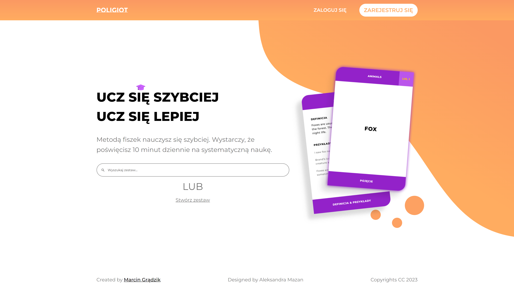

# Poliglot Frontend

Learn faster by using flashcards. All you need to do is spend 10 minutes a day to study systematically.




## Demo

[Check out our app in action!](https://www.google.com/)


## Tech Stack

**Client:** Angular, SCSS, Typescript

**Server:** Node, Express, MongoDB, JavaScript

[Server repository](https://www.google.com/)
  

## Installation

```bash
  npm install -g @angular/cli
  npm install 
```


## Usage

```bash
ng serve
```
